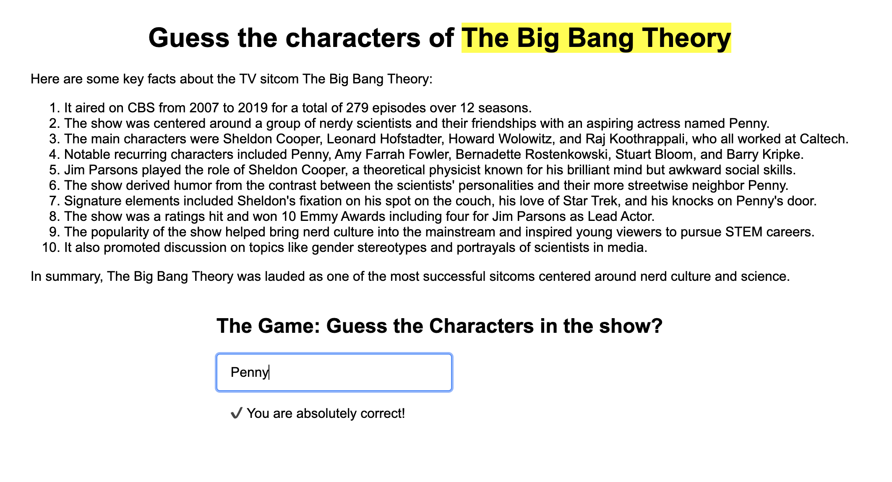

# The Big Bang Theory Character Guesser

This is a simple character guessing game app built with Vue.js. It's one of my first projects learning how to use Vue.

## About

The app displays a random character name from the TV show The Big Bang Theory. The user tries to guess the correct name of the character.

After submitting a guess, the app will indicate if it is correct or incorrect. It will also keep track of and display the number of correct and incorrect guesses.

The character names are valided using hardcoded data.

## Usage

The project uses Vue CDN links. Simply open the index.html file to run the app.

Submit a guess for the displayed character name and see if you know your Big Bang Theory trivia!

## Implementation

- Vue is included via CDN scripts and instantiated with a new Vue() root component

- Data, methods, computed properties handle game state and logic

- Simple UI with input, buttons, and result text

## Thoughts

This was a great simple app to start learning Vue.js basics like data, methods, computed, lifecycle hooks, etc. The reactive declarative nature makes building interactive UI logic intuitive.

Next steps are to expand on components, props, custom events to build more complex apps. Overall an enjoyable first Vue project!

## Credits

Character name data from https://bigbangtheory.fandom.com.
